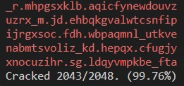

### Success Rate (%) of Frequency Analysis Methods by Input Size (multiple of block size)
  **Input Size**|**Simple**|**Complex**|**Both**
  :-----|-----:|-----:|-----:
  **1**| *4.17*| *5.32*| *7.41*
  **2**| *98.84*| *99.86*| *99.98*
  **3**| *99.95*| *100*| *100*
  **4**| *100*| *100*| *100*
  **5**| *100*| *100*| *100*

#

### Command Line Output Preview
  
